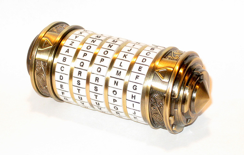

# SAINTCON 2015 PRE-4

```
-- CIPHERTEXT --
AEBRVHWWMQHURVWFFIKVYFUCDG
To Decrypt this Message, you will need to learn how a US President encrypted messages while in Paris France.

The PSK sequence you need to know is:
5,24,4,20,23,2,11,22,19,15,10,18,16,1,14,3,25,9,6,12,26,7,13,17,21,8
```

## Solve

Began with the obvious of throwing the ciphertext into [quipquip](http://www.quipquip.com) for easy pickings, no dice. Actually opened up the pdf to see a 2x2 grid of letters and then a circle at the bottom the size of a paper towel roll. 


This immediately sparked the memory of the Da Vinci Code cryptex. 



I began doing some awkward transformations of shifting each letter in the cipher text a number in the PSK:

```
A >> 5
E >> 24
B >> 4
R >> 20
... ect
```

Realizing this was a terrible idea, went back to the PDF to realize that there are numbers at the top of the 2x2 grid. It then became obvious that the PSK given is the order of the tumblers needed to solve the ciphertext.

The solution script does the following:
* Extracts each individual tumbler
* Arranges the tumblers in order based on the PSK
* Rotates each tumbler to match the ciphertext
* Prints every resulting line

Upon execution, we are given the following result:

```
AEBRVHWWMQHURVWFFIKVYFUCDG
XCDSNUMEXWPMMLNGHMNXOYGVET
KXVDCRBLWOURKYSBVPDJAMFBUW
MJZZIICYVMDNHTYMZXUDIIZFHK
BQNMFJJJSUJFYFPQKYOYTNWJKB
SBFTPZVDUHWLGUJYQEQWEWIONA
PFXQTQPXBCFQEWLSTSYOQSSRVL
HTTPHCSAINTCONORGJEFFERSON <--- Looks like a web page
IVKHZKAUGJNIIMFPMTRBDHTIPV
TMQUXWZOEDGBXCGUWQPEBBMNAD
OYUWSYENFLIJNJKTCBZAPJAZRE
GAEXRPRKHKMHQDXDRAJTSOXXQX
WKPKOXDCDVVPDKCOPDLRCPPYSP
RLHGWVLFAIEVJZILSZWPXVHMXI
FHSVQMKQKYOWVPQAJOTCVQDPBS
LZYOAEOVNRQYBBDZDRXNRKBAFM
UDLAKSURJPADLSBXLUBQLZCUYF
YUICLLGSPFKGTGUNBGSUJAVQGO
NPMIGTYTOTBKFETKYVILUUEWMQ
EIOEUNNMZGZZWRMVAKCINDYLCH
DGAJJDTHLSXSAXVJOFFZMTKHIY
JOGLEGQIRAYOCAECNHHSZGODJJ
ZNWFBBFPCXCTSQZHECVGKCQTLZ
VSRBMAHGQZSAZIHEILAHWRJGWC
CWJYDOIZYBLEPHAWUNMMHXLETR
QRCNYFXBTERXUORIXWGKGLNKZU
```

Checking out the website:

```
PROVE YOU SOLVED IT!
DM TWEET @SAINTCON: The Ciphertext three positions below the Plaintext
If you hate Twitter, an email to tj@saintcon.org will work too.

SOLVED BY: NOBODY YET
```

I don't think I was the first, but it was a great challenge nonetheless! Thanks to @saintcon for the pre-challenge and looking forward to more puzzles in the future.

## Final solution
```python

from collections import deque

ciphertext = 'AEBRVHWWMQHURVWFFIKVYFUCDG'
cipher = '''
R C X G O R U Q P T U V X L Z N Q S P V P I T M K E
X K N W G P D H X N G X P O B Q W O O O A P H Y Q Q
A W K R W Z T Y Y G Y J H F E D L T Z A R G Z A T F
Q Y V J R J G J E I N D D G Q J H A L C Q Z X K G D
I P J C F L C Z S M T Y B K W V D E R I S B S L M B
H X C B L W R C J V Q W C X O B T X C E X W R H W P
O V H D U T X R T E F O V C M L G U Q J B E O Z C S
V M E V Y X L U Q O H F E I U T E M Y L F L W D R C
L E W Z N B F G B Q I B Y Q H F K R T F Y Y Q U P X
Y S I N E S Y T A A X E K D C W C N M B G J A P S V
T L F F D I M W D K W A O B N A V F X Y M D K I J R
F T G X J C I K Z B M T Q U J C B L W N C X L G D L
U N B T Z F N B O Z B R J T D S F Q V R I A G O L J
W D M K V H W A R X C P L M L Z J C S S J U U N B U
N G Q Q C V S L U Y J C N V K P O I U D L O J S Y N
M B Y U Q A E N G C V N U E V U R B B Z W N E W A M
C A S E A M H V V S P Q G Z I R S J I M T K B R O Z
J O R P X G B D K L S U F H Y M I H G T Z C M E N K
D F P H K K J E F R A L Z A R K N P E Q D F D C E W
K H U S M N O X H H Z I W R P H Z V F P E Q Y X I H
Z U T Y B D P P C P E Z I W F Y X W H H U V V J U G
P R D L S U V I L U R S S N T G Y Y D U H R N Q X Y
B I O I P O Q S N D D G R S G E M D A W K S C B F O
S J L M H Q K M W J L H T Y S O P G K X N T I F H A
G Z A O I Y Z F I W K M M P A I A K N K V M F T V I
E Q Z A T E A O M F O K A J X X U Z J G O H P V Z T
'''

# Convert grid to 26 individual tumblers
cipher = zip(*[x.split() for x in cipher.splitlines()[1:]])

tumblers = []
final = []
psk = [5,24,4,20,23,2,11,22,19,15,10,18,16,1,14,3,25,9,6,12,26,7,13,17,21,8]

# Create cryptex
for index in psk:
    tumblers.append(cipher[index-1])

# Rotate tumblers to read ciphertext
for index,tumbler in enumerate(tumblers):
    tumbler = deque(tumbler)
    while tumbler[0] != ciphertext[index]:
        tumbler.rotate(1)

    final.append(list(tumbler))

# Flip 2D array to read everyline
"""
a b
c d
 |
 v
a c
b d
"""
final = zip(*final)

# Print all
for f in final:
    print ''.join(f)
```

